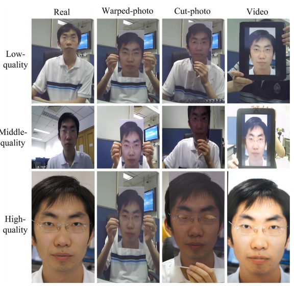
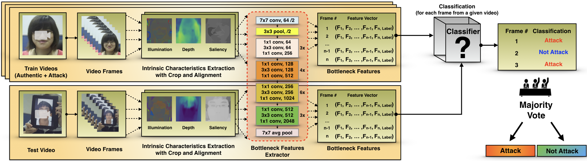

PADify (pronounced as /ˈpædfaɪ/) is a project to perform presentation attack detection (PAD) on publicly available datasets by using different intrinsic image properties along with Convolutional Neural Networks.

## Presentation Attack Detection

  

Fig 1 - Examples of Presentation Attack Detection

## Pipeline Overview

  

Fig 2 - Overview of proposed method

## Properties

- Illuminant Maps ([Carvalho et al.](https://ieeexplore.ieee.org/document/6522874/))
- Saliency ([Zhu et al.](https://ieeexplore.ieee.org/document/6909756))
- Depth ([Godard et al.](https://arxiv.org/abs/1609.03677))

# Datasets

- [CASIA Face Anti-Spoofing Database](http://www.cbsr.ia.ac.cn/english/Databases.asp)
- [Replay Attack](https://www.idiap.ch/dataset/replayattack)
- [NUAA Imposter Database](http://parnec.nuaa.edu.cn/xtan/data/nuaaimposterdb.html)
- [ROSE-Youtu Face Liveness Detection Dataset
](http://rose1.ntu.edu.sg/datasets/faceLivenessDetection.asp) (In Progress)

# License

This file is licensed under the MIT license. You can check the [LICENSE file](https://github.com/bresan/PADify/LICENSE) for more information.